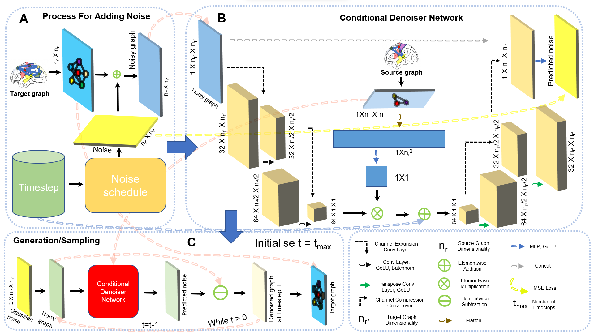

# Dif-GSR

This Repository contains the implementation of the paper "Dif-GSR" Diffusion-based Graph Super-resolution with
Application to Connectomics. This paper is accepted as a MICCAI workshop paper (PRIME-MICCAI 2023).



## Abstract

The super-resolution of low-resolution brain graphs, also known as
brain connectomes, is a crucial aspect of neuroimaging research, especially in
brain graph super-resolution. Brain graph super-resolution revolutionized neuroimaging
research by eliminating the need for costly acquisition and data processing.
However, the development of generative models for super-resolving brain
graphs remains largely unexplored. The state-of-the-art (SOTA) model in this domain
leverages the inherent topology of brain connectomes by employing a Graph
Generative Adversarial Network (GAN) coupled with topological feature-based
regularization to achieve super-resolution. However, training graph-based GANs
is notoriously challenging due to issues regarding scalability and implicit probability
modelling. To overcome these limitations and fully capitalize on the capabilities
of generative models, we propose Dif-GSR (Diffusion based Graph Super-
Resolution) for predicting high-resolution brain graphs from low-resolution ones.
Diffusion models have gained significant popularity in recent years as flexible
and powerful frameworks for explicitly modelling complex data distributions.
Dif-GSR consists of a noising process for adding noise to brain connectomes, a
conditional denoiser model which learns to conditionally remove noise with respect
to an input low-resolution source connectome and a sampling module which
is responsible for the generation of high-resolution brain connectomes. We evaluate
Dif-GSR using three-fold cross-validation using a variety of standard metrics
for brain connectome super-resolution. We present the first diffusion-based
framework for brain graph super-resolution, which is trained on non-isomorphic
inter-modality brain graphs, effectively handling variations in graph size, distribution,
and structure. This advancement holds promising prospects for multimodal
and holistic brain mapping, as well as the development of a multimodal
neurological disorder diagnostic frameworks. Our Dif-GSR code is available at
https://github.com/basiralab/Dif-GSR.

## Getting Started

1> Clone the repository with the following command:

```
 git clone https://github.com/basiralab/Dif-GSR.git
```

2> Install the requirements:

```
pip install -r requirements.txt
```

## Configurations

To Run the code configure the config.yaml file as per your requirement

The commands available are:

* functional_data (target connectomes): Path to dataset of shape(n_subjects X n_target_features) in the .mat format. Leave blank to use simulated data.
* morphological_data (source connectomes): Path to dataset of shape(n_subjects X n_source_features) in the .mat format. Leave blank to use simulated data.
* seed: set seed for reproducibility.
* use_wandb: set weights and biases as an option for model tracking.
* key: key for weights and biases.
* load_path_f{i}: path for the checkpoint for model trained on fold_{i} of data.
* guidance: Guidance parameter for sampling/generation.
* save_dir: Path to save the results.
* source_dim: source_features for a brain graph of shape (batch_size X source_dim X source_dim).
* accelerator: gpu or cpu. set this according to the necessary hardware requirement.
* epochs: number of epochs to train the model.
* dropout_prob: the probablity for dropping context in conditional training.
* fast_dev_run: run the validation loop once to test whether model is working correctly.
* target_dim: target_features for a brain graph of shape (batch_size X target_dim X target_dim).
* betas: beta values for the diffusion process.
* lr: learning rate for the model.
* n_T: Number of timesteps for the diffusion process.

## Running Code
After setting up the appropraite configurations run the following command to train the model:

```
python train.py
```

You will find the model checkpoints in the results/Diffusion_Train folder after training.

To Sample from the model run the following command:

```
python sample.py
```

The sampled pickle files are stored in the results/Diffusion_Sample folder.

To run the evaluation metrics on the sampled data run the following command:

```
python calculate_losses.py
```

The results are stored in the results/losses folder with the default configuration.

## Please cite the following paper when using Dif-GSR
```latex
@inproceedings{rajadhyaksha2023diffusion,
  title={Diffusion-Based Graph Super-Resolution with Application to Connectomics},
  author={Rajadhyaksha, Nishant and Rekik, Islem},
  booktitle={International Workshop on PRedictive Intelligence In MEdicine},
  pages={96--107},
  year={2023},
  organization={Springer}
}
```

